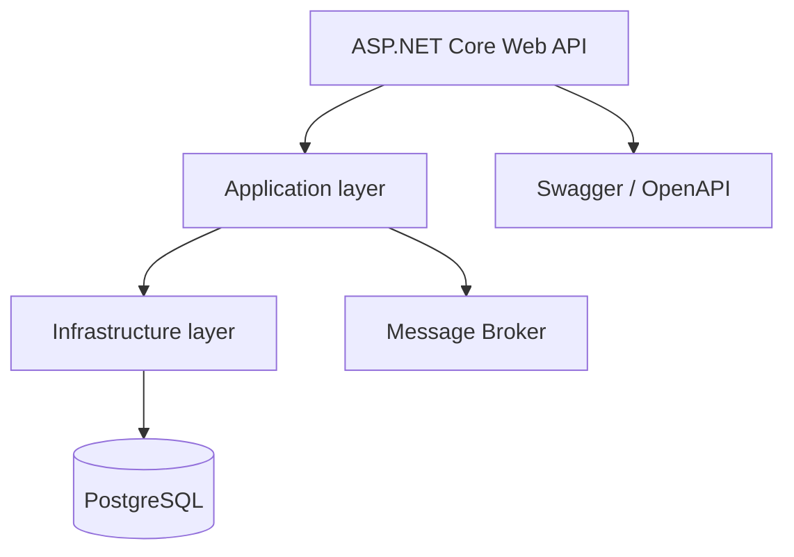

<div align="center">

# 🎬 HowestPrime Movies Service

**A REST API for the HowestPrime platform that manages the movie catalog and publishes domain events.**

<p>
  
  
  
  
  
  
  
</p>

</div>

> A lightweight, event-driven service that acts as the catalog source of truth for the platform.

## 📑 Table of Contents

- [📖 About](#about)
- [🏗️ Architecture](#architecture)
- [✨ Features](#features)
- [📱 API Surface](#api-surface)
- [🛠️ Tech Stack](#tech-stack)
- [🚀 Getting Started](#getting-started)
- [📄 License](#license)
- [👤 Author](#author)

## 📖 About

- This service manages movie data for the HowestPrime platform.
- It exposes a REST API for creating, reading, updating, and deleting movies.
- The service publishes domain events so other parts of the platform can react asynchronously.
- The startup project lives in `src/Howestprime.Movies.Main`.

## 🏗️ Architecture



## ✨ Features

**🎞️ Movie catalog**

- Create, update, and delete movie records.
- Retrieve movie details with filtering and pagination support.
- Keep the catalog available as the source of truth for the platform.

**📡 Integration**

- Publish movie-related events for downstream consumers.
- Keep the service container-friendly and environment-configurable.
- Expose health and API documentation endpoints for local development.

**📚 Documentation**

- Swagger UI for exploring the API.
- Contract-friendly project structure with clear application and infrastructure boundaries.

## 📱 API Surface

| Area | Details |
| --- | --- |
| REST API | Movie CRUD, filtering, and paging |
| Documentation | Swagger / OpenAPI |
| Events | Movie created, updated, and deleted messages |
| Runtime | ASP.NET Core web host |

## 🛠️ Tech Stack

| Area | Technologies |
| --- | --- |
| Language | C# |
| Framework | ASP.NET Core |
| Data access | Entity Framework Core |
| Database | PostgreSQL |
| Messaging | RabbitMQ or equivalent broker |
| Build | .NET SDK 10 |
| Docs | Swagger / OpenAPI |

## 🚀 Getting Started

### Prerequisites

- .NET 10 SDK
- PostgreSQL
- A message broker for event publishing
- The required configuration values for the runtime environment

### Restore dependencies

```bash
dotnet restore
```

### Run the service

```bash
dotnet run --project src/Howestprime.Movies.Main
```

### Run tests

```bash
dotnet test
```

### Open the API docs

When the service is running, open the Swagger UI at `http://localhost:8000/swagger/`.

## 📄 License

This project is used for educational and demo purposes within the HowestPrime course context.

## 👤 Author

| Name | GitHub | LinkedIn |
| --- | --- | --- |
| Maurice De Kegel | [MriceDK](https://github.com/MriceDK) | [LinkedIn](https://www.linkedin.com/in/dekegelmaurice/) |
